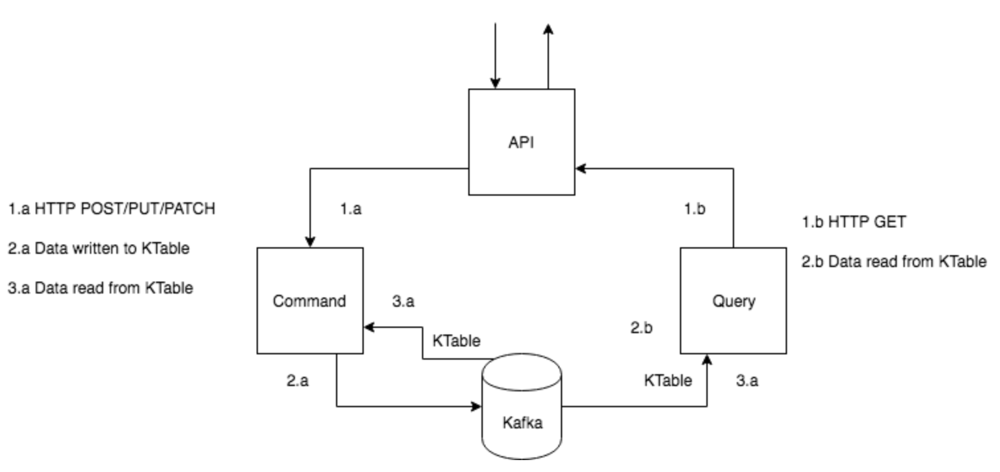

# Booking System POC

This application demonstrates an application architecture of a booking system. 
It served as only a prove of concept to implement an event sourced system with
minimal flow of typical use case in cargo shipment business domain.

## Overview of Booking Business Model

In a typical scenario, a customer requests to ship one or many cargos. 
A request causes a creation of booking request a long with the associated
cargos requested. Knowing the origin location of the cargos and their final
destinations, the system automatically obtains proper shipping port routing 
and detail routing legs for every cargo.

Other services in the system can react to actions in this booking service to
create operation jobs to different stakeholders to
perform tasks in order to fulfill the requested shipments.

Interactions with this booking service is also intended to serve different 
analytics data and lookup booking details and summaries using different 
search criteria.

## The Architecture

Event based communication and sourcing is used in this architecture to handle
interactions and cater various needed queryable data views. Separating system
clients' commands from auto-generated data projections pattern of CQRS is found
to be handy to achieve such goals.

The architecture consists of Spring-boot based microservics, mainly the command
service and query service. events are in JSON format to
easily serialize and deserialize between interested parties and even non-java based services.

External clients interact with the system via APIs, that in turns uses commands to perform
actions on any of the entities via the "root" aggregate. Subsequently, domain events are published as 
a result of these interactions. Other services can listen to these domain events and project / aggregate 
needed data views.

Kafka messaging broker along with its KStream and KTable APIs are used in the POC. KStream 
listens to published domain events and keep any point-in-time snapshopt of the "root" aggregate
in a KTable to source it by the command service.

  

## Project Modules

This repository consists of these modules

* poc-booking-common: Sharable domain, command and event models.
* poc-booking-service-cmd: The command service to interact with the system (write-only purpose).
* poc-booking-service-qry: The query service listens to command service's generated domain events to
project data views and serve to query these views.
* poc-booking-gateway: API gateway serves as a proxy to the command and query services.

## Run Kafka Locally

 * [Download](https://kafka.apache.org/downloads) kafka
 
 * extract the downloaded file, and navigate to the kafka home directory
 
 *  run this command to bring up ZooKeeper
 ``` shell
 bin/zookeeper-server-start.sh config/zookeeper.properties 
 ```
 * run this command to bring up Kafka
 ```shell 
 bin/kafka-server-start.sh config/server.properties
 ``` 

## Run the Project Locally

* Clone this project.

* Run the command below inside poc-booking-service-cmd, poc-booking-service-qry and 
poc-booking-service-gateway folders:
```bash
$ mvn spring-boot:run
```

## Create Booking

To create a new booking, hit the url at (http://localhost:8081) with
the JSON payload below.

```json
{
   "cargoRequests": [
     {
       "requiredSize": "SIZE_20",
	   "nature": "DANGEROUS_CARGO",
	   "origin": {
		"opZone": "zone-1",
		"facility": "facility-1"
	   },
	   "destination": {
		"opZone": "zone-4",
		"facility": "facility-4"
	   },
       "cutOffDate": "2019-08-01 10:30:00"
     },
      {
       "requiredSize": "SIZE_40",
	   "nature": "GENERAL_CARGO",
	   "origin": {
		"opZone": "zone-5",
		"facility": "facility-5"
	   },
	   "destination": {
		"opZone": "zone-7",
		"facility": "facility-7"
	   },
       "cutOffDate": "2019-08-10 12:00:00"
     }
   ]
}
```


